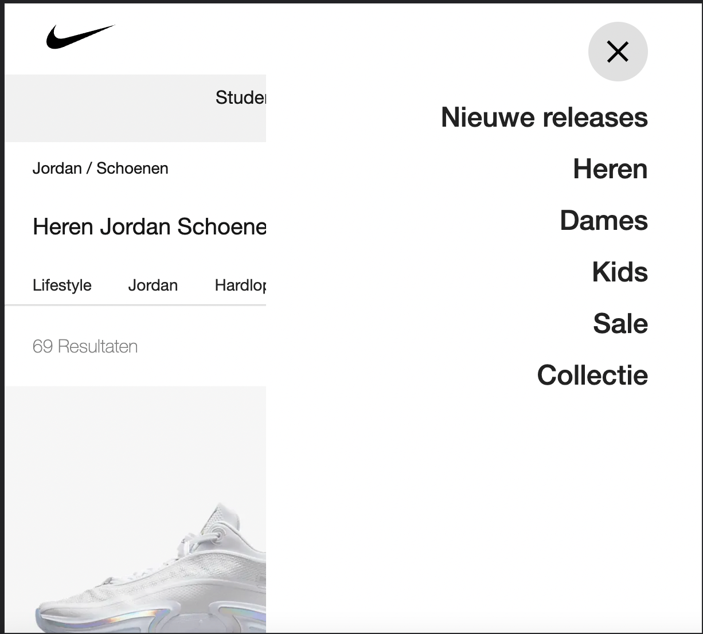

# Procesverslag
Markdown is een simpele manier om HTML te schrijven.  
Markdown cheat cheet: [Hulp bij het schrijven van Markdown](https://github.com/adam-p/markdown-here/wiki/Markdown-Cheatsheet).

Nb. De standaardstructuur en de spartaanse opmaak van de README.md zijn helemaal prima. Het gaat om de inhoud van je procesverslag. Besteedt de tijd voor pracht en praal aan je website.

Nb. Door *open* toe te voegen aan een *details* element kun je deze standaard open zetten. Fijn om dat steeds voor de relevante stuk(ken) te doen.

## Jij

  
uitwerken voor kick-off werkgroep

  ### Auteur:
  Dante Mommers

  #### Je startniveau:
  Rood

  #### Je focus:
  responsive
 

## Je website

  
uitwerken voor kick-off werkgroep

  ### Je opdracht:
  https://www.nike.com/nl/?cp=63928816257_search_%7cnike%7c10582771586%7c104693151076%7ce%7cc%7cNL%7cpure%7c452284024734&ds_rl=1252249&gclid=Cj0KCQjw39uYBhCLARIsAD_SzMQqJ0QOnvRCPfD9azePjZxFqYFvjoEmXgwJnNdDy6XgYrRuCUlvcqAaAtfSEALw_wcB&gclsrc=aw.ds

  #### Screenshot(s) van de eerste pagina (small screen): 
  Home Pagina 
  

  #### Screenshot(s) van de tweede pagina (small screen):
  Schoenen Pagina  
  
 

## Toegankelijkheidstest 1/2 (week 1)

  
uitwerken na test in 1e werkgroep

  ### Bevindingen
  Lijst met je bevindingen die in de test naar voren kwamen:

  #### Screenreader
  Met de screenreader ging opzich goed. Alle belangrijke dingen kunngen gedaan worden. alleen is het wel heel lastig om te gebruiken. de website had op sommige plekken wel betere heading kunnen hebben. dus dat zou ik kunnne verbeteren

  #### Muis en Toetsenbord 
  Met de muis ging het natuurlijk perfect alleen met de toetsenboard niet helemaal.

  ALs je ging tappen blijf je vast zitten in de search. je moet dan op het kruisje klikken voordat je eruit komt. niet onlogisch maar je kan dus niet in 1 keer helemaal naar beneden tappen. je moet wel opletten.
    

  #### Motoriek (shocks, elastiekjes)
  We gingen met elestiekjes en een shock apparaat (een emulatie van parkisons decease) kijken of de website nog goed te gebruiken was. met de elestiekjes lukte het, zeker op de computer. maar telefoon werdt al wat lastiger. je moest je telefoon erg ongemakkelijk vasthouden maar dat was het ook.

  Bij het shock apparaat werdt het heel lastig. de laptop was bijna niet te gebruiken en de telefoon al helemaal niet. alleen vind ik het wel lastig om een oplossing daarvoor te bedenken of iets waar dat heel erg mee zal helpen.

  #### Visueel (brillen, contrast, kleurenblind, dark/light). 
We gingen met verschillende brilletjes om verschillende visuele beperkingen te bekijken. met de meest brllen viel het mee, maar erg irritant dat zeker. en bij sommige waren bepaalde dingen niet te lezen of te doen. dat was wel erg lastig. het beste wat we kunnen doen voor die mensen volgensmij is het contrast hoog maken. bepaalde kleuren gebruiken / opties maken zodat mensen kunnen kiezen tussen kleuren zodat ze kunnen kiezen wat ze het beste kunnen zien.

## Breakdownschets (week 1)

  
uitwerken na afloop 2e werkgroep

  ### de hele pagina: 
  

  ### dynamisch deel (bijv menu): 
  

## Voortgang 1 (week 2)

  
uitwerken voor 1e voortgang

  ### Stand van zaken
  Het meeste ging erg goed. ik had eerst moeite met grid en de @media. maar dat ging met behulp van de studentenassistent weer goed
  

  ### Agenda voor meeting
  samen met je groepje opstellen

  | student 1      
  | Ik wil even weten of ik spans op de juiste manier gebruik. en of de fouten die ik krijg na het valideren van de HTML of ik daar wat mee moet doen.          
  |           

  | student 2          | student 3    | student 4        |
  | ---                | ---          | ---              |
  | en dit             | en ik dit    | en dan ik dat    |
  | dit als er tijd is | nog een punt | dit wil ik zeker |
  | ...                | ...          | ...              |

  ### Verslag van meeting
  hier na afloop snel de uitkomsten van de meeting vastleggen

  - Mijn spans moet ik verandere in Div omdat ik spans gebruikte op een plek waar ik divjes moest gebruiken. spans = inline, div = block
  - P's die links horen te zijn verandere in A'tjes
  - Nav gebruiken inplaatsvan Span
  - Button verandere in A'tjes (behalve eerste op de eerste pagina)
  - Hr weghalen en Border gebruiken
  - Footer - Spans verandere in Details
  - Read.me Nu bijwerken

## Voortgang 2 (week 3)

  
uitwerken voor 2e voortgang

  ### Stand van zaken
  Deze week heb ik vooral gewerkt aan het optimalizeren en verbeteren van mijn code. onnodige code weghalen. daarnaast was ik ook bezig met het maken van de hamburger menu en het verbeteren/mooier maken ervan.

  ### Agenda voor meeting
  samen met je groepje opstellen - Andere mensen uit mijn groepje waren er niet.

  student 1
  naar mijn code kijken en kijken wat er nog verbetert kan worden
  En waar ik in het vervolg het beste aan kan werken. waar moeten mijn prioritijten liggen.

  ### Verslag van meeting
  hier na afloop snel de uitkomsten van de meeting vastleggen

  - Code was prima. er was niet echt heel erg optimalizeren voor de wat ik eruit zou halen. de moeite zou het niet waard zijn
  - volgende aandachts punten waren: 1: A om de articles en H3, h4 toepassen. 2: Scroll toevoegen op de 3e header (link naar stuntenkorting), 3: filter toevoegen op de schoenen pagina. 4: search toevoegen. 5: filter werkend maken. 6: search werkend maken.

## Toegankelijkheidstest 2/2 (week 4)

  
uitwerken na test in 8e werkgroep

  ### Bevindingen
  Het lastige voor mij was is dat ik niet heel goed op de accessibility aan het letten was. Ik was heel erg gefocust op het precies namaken van de website. Dus voor mij waren er helaas niet veel nieuwe bevindingen. het waren de zelfde soort problemen als de orginele website. 

  #### Screenreader
  De screenreader had moeite met de website en ik ook zeker met de screenreader. Het ging eerst vrij goed alleen op klein scherm heeft hij wat moeite met de    hamburgermenu. Wat ook lastig was ik had niet de juiste headings op bepaalde plekken gezet. en omdat je niet lekker door de website kan tappen werkt ook niet lekker mee.

  Wat ik vooral kan verbeteren zijn de headings. De tap functionaliteit waar ik de screenreader ook erg van zou profiteren. (met indien nodig afbeeldingen)

  #### Muis en Toetsenbord 
  Het ging reddelijk goed tot dat ik met de hamburger menu zat. daar tap je doorheen ook al zie je hem niet. dus dat is iets wat ik moet oplossen. Ook was dit het geval op de tweede pagina. Maar een stuk meer. Ik heb een filter waar je doorheen tapt zonder te zien. Dit gebeurde ook met de scrollbare categorieën. allemaal verbeterpuntejes. (met indien nodig afbeeldingen)

 Het gene wat opgelost kan worden is het tappen door de gesloten hamburger menu, scrollbare categorieën en filters. 

  #### Motoriek (shocks, elastiekjes)
  Net zoals hiervoor was dit weer lekker lastig. telefoon was niet te gebruiken. en de laptop al helemaal niet. het geeft je zeker persepectief over hoe slecht sommige mensen het kunnne hebben.

  Er moet iets heel nieuws voor die mensen komen want ik niet hoe ik mijn website kan verbeter op zo'n manier zonder de hele website te veranderen voor die mensen.

  #### Visueel (brillen, contrast, kleurenblind, dark/light). 
Hier geld precies het zelfde als de vorige keer. je ziet echt heel erg slecht door sommige brillen. het beste wat ik kan doen is het contrast hoog houden. want best goed is gedaan omdat dat bijna alles zwart op wit is of andersom.

## Voortgang 3 (week 4)

  
uitwerken voor 3e voortgang

  ### Stand van zaken
Ik heb niet heel hard kunnen werken deze week maar heb toch een paar hele leuke dingen gedaan. vooral heb ik de filter toegevoegd. voor klein en groot scherm.

  ### Agenda voor meeting
Zelf opstellen.
  
  Ik mijn grootste vraag was is is hoe ik mijn hamburger menu te verbeteren. daarnaast hoe ik transistion kon laten werken. op de schoentjes. wat mij nog niet was gelukt.
  
  Ik had ook een vraag omdat ik een probleempje had met een weghalen van een marker. die op de andere plek van mijn website wel weg ging maar daar niet. vond ik raar dus wou het even navragen.

  ### Verslag van meeting
  hier na afloop snel de uitkomsten van de meeting vastleggen

  - States toevoegen
  - Voor de hamburger menu moet ik display: none of :focus-within gebruiken. na het bekijken van mijn wbsite hebben ik en vasilles besloten dat disnlay:none de beter optie was.
  - Radiobuttons en checkboxes namen geven. voor wat extra functionaliteit en detail.
  - in mijn css had ik op regel 982 een visabilitie:hidden staan die niet nodig was, en zelf een stukje transitie weghaalde
  - op regel 76 kon ik beter display: grid neerzetten en grid-collumn-template (0fr, 3fr) toevoegen.
  - De schoenen animatie geven maar dit moest ik als laatste doen als ik tijd over had
  - Mijn logo in een h1 zetten
  - Bij section 3 & 5 de middeste tekst terug omzetten naar een P inplaatvan de h4 die mij vertelt was te doen in de vorige feedback sessie.
  - de H1 op mijn website omzetten naar een h2 want dat gaf betere semantiese waarde.
  

## Eindgesprek (week 5)

  
uitwerken voor eindgesprek

  ### Je uitkomst - karakteristiek screenshots:
  
  
  
  
  
  
  
  

  ### Dit ging goed/Heb ik geleerd: 
  Ik heb echt heel veel dingen geleerd. alles van de flex froggy, grid garden, media queue, css selectoren, javascript is weer wat opgefrissed, position relative, sticky & absolute, Hamburger menu, animatie, CUSTOM PROPERTIES met variable, semantisch html en nog een heleboel.

  

  ### Dit was lastig/Is niet gelukt:
  De accessibility verbeteren, ik heb het echt geprobeerd en zeker met het tappen maar er leek geen goede oplossing te zijn/ik kon die niet vinden in de tijd die ik nog overhad. 
  
  Een klein beetje responsiveness. als je van 60 em naar lagen dan 60 em met de filter open gaat die niet weg tot dat je hem weer groter maakt zodat je de filter kan sluiten. gelt ook de andere kant op met de filter. 
  
  

## Bronnenlijst

  
continu bijhouden terwijl je werkt

  Nb. Wees specifiek ('css-tricks' als bron is bijv. niet specifiek genoeg).

  1. bron 1: https://stackoverflow.com/questions/5467605/add-a-space-after-an-element-using-after
  2. bron 2: https://developer.mozilla.org/en-US/docs/Web/HTML/Element/details#a_simple_disclosure_example 
  3. bron 3: https://justmarkup.com/articles/2020-09-22-styling-and-animation-details/
  4. bron 4: Studentenassistenten (toppers)

